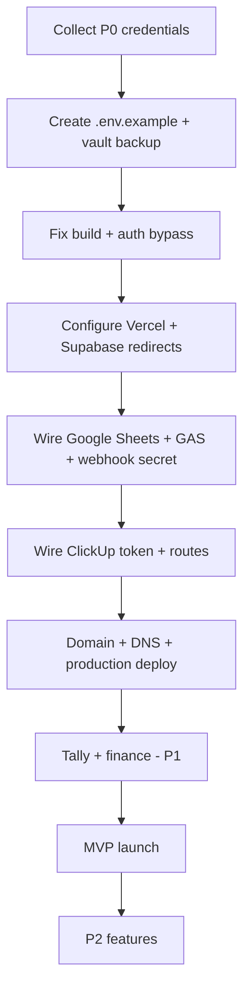

# FBOS V4 — Blocker Register

**Purpose:** Ranked list of blockers preventing or delaying FBOS V4 production.  
**Date:** 2026-06-20  
**Companion doc:** `DEPENDENCY_READINESS_CHECKLIST.md`  
**Mode:** Pre-implementation — no code changes.

---

## Priority definitions

| Rank | Meaning | Action |
|---|---|---|
| **P0** | Stops project — cannot develop safely or deploy | Resolve before any production work |
| **P1** | Major delay — MVP degraded or high risk | Resolve before launch |
| **P2** | Nice to have — post-MVP or optional features | Schedule after launch |

---

## P0 — Stops project

| ID | Blocker | Category | Dependency | Impact | Mock/bypass? | Resolution |
|---|---|---|---|---|---|---|
| P0-01 | **Auth hard-disabled** — `isAuthDisabled()` returns `true` always | Security / App | Supabase Auth | All users = mock super_admin; prod deploy = total exposure | No (must fix) | Restore env-based auth; set `NEXT_PUBLIC_AUTH_DISABLED` false |
| P0-02 | **Root middleware no-op** — `middleware.ts` passes all traffic | Security / App | Supabase Auth | Sessions never enforced at edge | No | Wire `lib/middleware.ts` logic or Next.js 16 proxy |
| P0-03 | **Production build fails** — TypeScript errors | Build | Node / codebase | Cannot ship artifact | No | Fix TS errors in auth config, gsheet-hub, gsheet |
| P0-04 | **No `.env.local` / `.env.example`** in repo or vault | Secrets | All | Dev stops when laptop changes; unknown env contract | Partial (hardcoded GAS URL) | Create `.env.example`; vault backup of live env |
| P0-05 | **Supabase service role key not in secure shared vault** | Secrets | Supabase | Webhooks, admin scripts, GAS sync fail without it | No | Collect + store in password manager |
| P0-06 | **`SUPABASE_SERVICE_ROLE_KEY` + anon + URL trinity missing from Vercel** | Deploy | Supabase + Vercel | Hosted app cannot connect to DB | No | Configure Vercel env before first deploy |
| P0-07 | **`SHEET_SYNC_SECRET` not set or not shared GAS ↔ Next.js** | Integration | Google Sheets + GAS | Webhook returns 401; sheet sync broken | No | Generate secret; set in Vercel + GAS properties |
| P0-08 | **Google Sheet ID + Apps Script deployment not confirmed** | Integration | Google Sheets + GAS | Lead/finance sync nonfunctional | Partial (CSV only) | Collect sheet URL, ID, GIDs, deploy URL |
| P0-09 | **Single-owner GitHub + Supabase** — no backup admin | Ownership | GitHub + Supabase | Account lockout = project lockout | No | Add second admin on both |
| P0-10 | **Auth redirect URLs not configured for production domain** | Deploy | Supabase Auth + DNS | Login/callback fails after deploy | No | Set URLs in Supabase once domain known |

---

## P1 — Major delay

| ID | Blocker | Category | Dependency | Impact | Mock/bypass? | Resolution |
|---|---|---|---|---|---|---|
| P1-01 | **Integration API routes stubbed** — no `authorize()` on clickup/config/dedupe | Security / App | ClickUp + RBAC | Future data leak when routes implemented | No | Add RBAC before wiring real handlers |
| P1-02 | **`CLICKUP_API_TOKEN` not collected** | Integration | ClickUp | ClickUp sync cannot run live | Yes (demo data) | Collect token + list IDs |
| P1-03 | **ClickUp route disconnected from library** — placeholder only | Integration | ClickUp | Tasks page empty despite library existing | Yes (demo) | Wire `app/api/integrations/clickup/sync` to `lib/integrations/clickup.ts` |
| P1-04 | **`integrations/route.ts` stub** — UI expects sync data | Integration | Multiple | Integration hub incomplete | Partial | Restore full integrations API |
| P1-05 | **`finance_transactions` RLS enabled, zero policies** | Database | Supabase | Finance transaction table unusable | No | Add RLS policies via approved migration |
| P1-06 | **Supabase migration history empty** — schema drift | Database | Supabase | Cannot reproduce DB from repo alone | Partial | Export schema; reconcile migrations |
| P1-07 | **Empty migration `005_leads_clickup_dedupe.sql`** | Database | Supabase | Incomplete schema restore | No | Populate SQL before any migration run |
| P1-08 | **Hardcoded Google Web App URL** in `lib/google-config.ts` | Integration | GAS | Wrong environment if deployment changes | Partial (env override) | Move to `GOOGLE_WEBAPP_URL` env only |
| P1-09 | **Vercel project not created / not linked to GitHub** | Deploy | Vercel | No production hosting path | Yes (local dev) | Create Vercel project + env |
| P1-10 | **Production domain + DNS not decided** | Deploy | Domain/DNS | Cannot finalize auth redirects, webhooks, GAS `FBOS_WEBHOOK_URL` | Yes (`*.vercel.app` staging) | Choose domain; delegate DNS |
| P1-11 | **Tally host / company not configured** | Integration | Tally | Finance connector stays pending | Yes (`TALLY_DEMO_XML`) | Collect host, port, company; install bridge |
| P1-12 | **GAS script properties not set** (`FBOS_WEBHOOK_URL`, Supabase keys) | Integration | GAS | Scheduled sync never calls app | No | Configure all script properties |
| P1-13 | **Tab GIDs empty** in `getSheetTabGids()` | Integration | Google Sheets | Multi-tab sync broken | Partial | Collect GID per tab from sheet URL |
| P1-14 | **No encrypted backup of secrets** | Ops | Backup storage | Disaster = unrecoverable prod | No | Implement vault + off-site backup per `BACKUP_PLAN.md` |
| P1-15 | **10× SECURITY DEFINER functions callable by anon** (Supabase advisor) | Security | Supabase | Elevated RPC exposure | No | Revoke EXECUTE from anon (approved migration) |
| P1-16 | **Permissive RLS inserts** on `audit_logs`, `lead_history` | Security | Supabase | Audit trail spoofing risk | No | Tighten policies (approved migration) |
| P1-17 | **Missing `/api/integrations/health`** — UI calls nonexistent route | Runtime | App | Integration hub errors | Yes | Implement route or remove UI call |
| P1-18 | **SMTP / auth email not configured** | Auth | Gmail/SMTP | User invites / magic links fail in prod | Partial | Configure Supabase Auth SMTP or provider |

---

## P2 — Nice to have

| ID | Blocker | Category | Dependency | Impact | Mock/bypass? | Resolution |
|---|---|---|---|---|---|---|
| P2-01 | **WhatsApp not implemented** | Feature | WhatsApp | Automation center claim only | Yes | Phase 2+ Meta WABA integration |
| P2-02 | **Twilio not implemented** | Feature | Twilio | No SMS fallback | Yes | Add if chosen over Meta direct |
| P2-03 | **AI provider integration absent** | Feature | OpenAI etc. | AI pages are scaffold | Yes | Add when product scope confirmed |
| P2-04 | **Google Drive integration absent** | Feature | Google Drive | No document library | Yes | Add if needed |
| P2-05 | **Supabase Storage buckets not created** | Feature | File storage | No file uploads | Yes | Create buckets + RLS when needed |
| P2-06 | **No CI/CD pipeline** (GitHub Actions / Vercel auto) | Ops | GitHub + Vercel | Manual deploy only | Yes | Add workflow post-MVP |
| P2-07 | **Large audit artifacts in repo** (5 MB+ tree dumps) | Repo hygiene | GitHub | Bloat, recon leakage | Yes | Gitignore / remove in approved cleanup |
| P2-08 | **npm moderate vulnerabilities** (2) | Dependencies | npm | Supply chain risk | Partial | `npm audit fix` when approved |
| P2-09 | **Lint errors in google-apps-script tooling** (73) | Dev UX | Scripts | CI noise if lint expanded | Yes | Exclude scripts from lint or fix |
| P2-10 | **Package name `fbos-v1` vs `fbosv4`** | Naming | GitHub | Confusion only | Yes | Rename when approved |
| P2-11 | **Next.js middleware → proxy migration** | Platform | Vercel | Deprecation warning | Yes | Migrate when Next docs finalized |
| P2-12 | **Second Supabase project `financeos`** — scope unclear | Architecture | Supabase | Potential duplicate data plane | Yes | Document single source of truth |

---

## Blocker counts

| Priority | Count | Status |
|---|---:|---|
| P0 | 10 | 🔴 Must clear before production |
| P1 | 18 | 🟠 Must clear before MVP launch |
| P2 | 12 | 🟡 Deferrable |

---

## Critical path (recommended order)

---

## Dependency → blocker mapping

| Dependency | Highest blocker |
|---|---|
| GitHub | P0-09 |
| Supabase | P0-05, P0-06, P0-10, P1-05, P1-06, P1-15, P1-16 |
| Vercel | P0-06, P1-09 |
| ClickUp | P1-02, P1-03 |
| Tally | P1-11 |
| Google Sheets | P0-08, P1-13 |
| Google Apps Script | P0-07, P0-08, P1-08, P1-12 |
| Gmail/SMTP | P1-18 |
| Domain/DNS | P0-10, P1-10 |
| SSL | Covered by Vercel (P1-09) |
| Backup storage | P1-14 |
| WhatsApp / Twilio / AI | P2-01, P2-02, P2-03 |

---

## Status

Blocker register complete. Cross-reference `DEPENDENCY_READINESS_CHECKLIST.md` for credential collection. **No code modified.**
