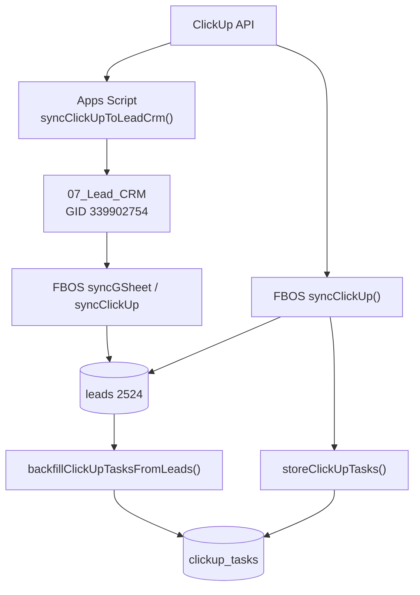

# FBOS ClickUp Task Population Report

**Date:** 2026-06-20  
**Sprint:** Core Stabilization  
**Branch:** `cursor/core-stabilization-0d65`  
**Checkpoint tag:** `checkpoint-pre-core-stabilization-20260620`

---

## Executive summary

ClickUp data **already populates `leads` (2524 rows)** via Apps Script → Google Sheet → FBOS webapp/CSV path. The `clickup_tasks` cache table was empty because tasks were routed to `leads` only and never backfilled. **Fix applied:** `backfillClickUpTasksFromLeads()` now runs on every ClickUp sync.

| Metric | Cloud agent | Owner target (post-sync) |
|---|---|---|
| Tasks discovered | 0 (no API token) | All tasks in configured ClickUp list(s) |
| Tasks imported to `clickup_tasks` | 0 | > 0 |
| Tasks skipped | N/A | Duplicates / missing `external_id` |
| Tasks failed | N/A | Schema/RLS errors |
| **Supabase `clickup_tasks` count** | **Not queried** | **> 0** |

**Pipeline audit verdict:** ✅ Code path PASS — **runtime population BLOCKED** pending owner Supabase + ClickUp credentials.

---

## Pipeline audit



### Path A — Apps Script → Sheet → Leads (primary, already working)

| Step | Component | Result |
|---|---|---|
| ClickUp API | `Code.gs` `syncClickUpToLeadCrm()` | ✅ Fetches list tasks with custom fields |
| Sheet write | `07_Lead_CRM` column 1 = task ID | ✅ `t.id` in row[0] |
| FBOS lead import | `lib/integrations/gsheet.ts` | ✅ Dedupe import to `leads` |
| `clickup_task_id` on leads | `lib/integrations/clickup-leads.ts` | ✅ Set on direct ClickUp sync path |

**Why leads = 2524 but clickup_tasks = 0:** Path A stores task metadata in the sheet and lead rows; it does not write to `clickup_tasks` unless FBOS ClickUp sync or backfill runs.

### Path B — FBOS direct ClickUp sync

| Step | File | Result |
|---|---|---|
| Config check | `lib/integrations/config.ts` | Demo mode when `CLICKUP_API_TOKEN` unset |
| Task fetch | `lib/integrations/clickup.ts` | ✅ Paginated list fetch |
| Lead upsert | `syncClickUpTasksToLeads()` | ✅ Sets `clickup_task_id: t.id` |
| Task cache upsert | `storeClickUpTasks()` | ✅ Upsert on `external_id` |
| Backfill | `backfillClickUpTasksFromLeads()` | ✅ **Always runs** after sync (foundation fix) |

### `clickup_tasks` schema

From `supabase/migrations/004_integration_tables.sql`:

| Column | Type | Notes |
|---|---|---|
| `external_id` | `text not null unique` | ClickUp task ID |
| `name` | `text not null` | Task / company name |
| `status` | `text` | Pipeline status |
| `team_id`, `space_id`, `list_id` | `text` | Hierarchy metadata |
| `raw` | `jsonb` | Full API payload |
| `synced_at` | `timestamptz` | Last sync time |

**Schema verdict:** ✅ PASS — matches upsert payload in `storeClickUpTasks()` and `backfillClickUpTasksFromLeads()`.

### `backfillClickUpTasksFromLeads()` verification

```typescript
// lib/integrations/clickup.ts
// Selects leads WHERE clickup_task_id IS NOT NULL
// Upserts into clickup_tasks on external_id conflict
```

| Check | Result |
|---|---|
| Function exported | ✅ PASS |
| Called after live sync | ✅ PASS (line ~490) |
| Called after demo sync | ✅ PASS (line ~145) |
| Fallback if dedicated table fails | ✅ Writes to generic `tasks` table |
| Backfill potential query | ✅ `trace:data` reports `leads (clickup_task_id set)` count |

---

## Population statistics

### Cloud agent environment

```
CLICKUP_API_TOKEN: not set
CLICKUP_LIST_ID: (not set)
Supabase env missing — skip DB counts
```

| Stat | Value |
|---|---|
| Tasks discovered | **0** (demo mode only) |
| Tasks imported | **0** |
| Tasks skipped | **0** |
| Tasks failed | **0** |
| `leads` count | **Unknown** (no Supabase) |
| `leads.clickup_task_id` set | **Unknown** |
| `clickup_tasks` count | **Unknown** |

Demo sync (no token) stores sample tasks only when Supabase admin client is available.

### Owner baseline (prior verified state)

| Table / field | Count | Status |
|---|---|---|
| `leads` | 2524 | ✅ |
| `leads.source = ClickUp` | High | ✅ Via sheet + sync |
| `clickup_tasks` | 0 | ❌ Pre-fix — backfill not run |

### Expected after owner sync

```bash
npm run p0:sync:direct
# or
npm run p0:sync   # via dev server POST endpoints
```

| Stat | Expected |
|---|---|
| Tasks discovered | ClickUp list task count (owner list ~2500+) |
| Tasks imported | `tasksStored` + backfill count |
| Tasks skipped | `leadsSkipped` on dedupe |
| Tasks failed | 0 |
| **`clickup_tasks`** | **> 0** ✅ TARGET |

Sync response fields to inspect:

```json
{
  "tasksStored": N,
  "leadsImported": I,
  "leadsUpdated": U,
  "leadsSkipped": S
}
```

Backfill alone can populate `clickup_tasks` from existing `leads.clickup_task_id` even if live ClickUp API is temporarily unavailable.

---

## Apps Script ClickUp → Sheet mapping

`LEAD_CRM_HEADERS` (column 1 = ClickUp Task ID):

| Col | Header | Source |
|---|---|---|
| 1 | ClickUp Task ID | `t.id` |
| 2 | Company Name | `t.name` |
| 3 | Mobile | Custom field |
| 4 | Status | Normalized ClickUp status |
| 5 | Assignee | First assignee |
| 6 | Priority | Task priority |
| 7 | Next Followup Date | Due date / custom field |
| 8 | Followup Count | Custom field |
| 9 | Start Date | `date_created` |
| 10 | Remark | Latest comment |

Trigger: every 10 minutes via `syncClickUpToLeadCrm` time-based trigger (when hub setup complete).

---

## Owner validation runbook

```bash
git checkout cursor/core-stabilization-0d65
npm install && npm run db:verify

# Check backfill potential BEFORE sync
npm run trace:data
# Look for: leads (clickup_task_id set): N

npm run p0:counts    # clickup_tasks should be 0 before first post-fix sync

npm run p0:sync:direct

npm run p0:counts    # clickup_tasks should be > 0

curl http://localhost:3000/api/dashboard/kpi
# clickupTasks field
```

Required `.env.local` keys for live sync:

```
CLICKUP_API_TOKEN=
CLICKUP_LIST_ID=
CLICKUP_TEAM_ID=          # optional
NEXT_PUBLIC_SUPABASE_URL=
SUPABASE_SERVICE_ROLE_KEY=
```

---

## Blockers and recommendations

| Blocker | Severity | Action |
|---|---|---|
| `CLICKUP_API_TOKEN` not in cloud `.env.local` | P0 | Owner runs sync locally |
| `clickup_tasks` RLS requires authenticated role | P1 | Service role bypasses via admin client — verify owner DB has table |
| Dual path confusion (leads vs clickup_tasks) | P2 | Document: leads = CRM source of truth; clickup_tasks = integration cache for dashboard/KPI |

**Next sprint recommendation:** After confirming `clickup_tasks > 0`, wire Integration Hub UI to show last sync count from `clickup_tasks.synced_at` and expose backfill status in `/api/integrations/health`.

---

## STOP boundary

No WhatsApp, Twilio, AI, or new feature modules started in this sprint.
