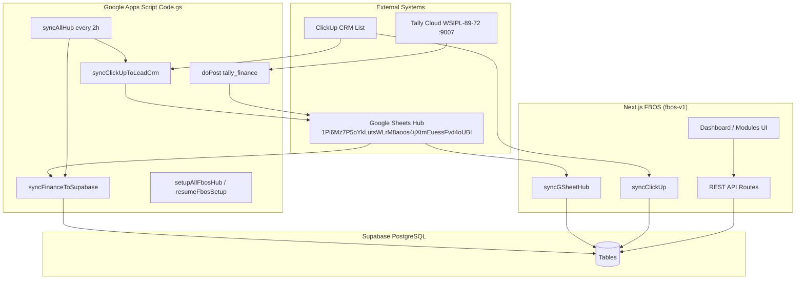
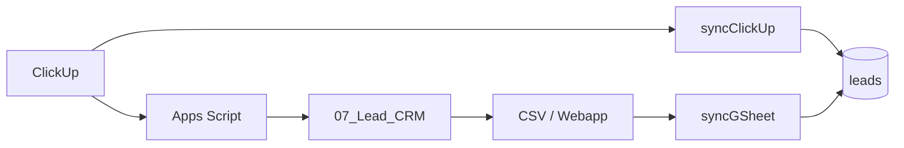
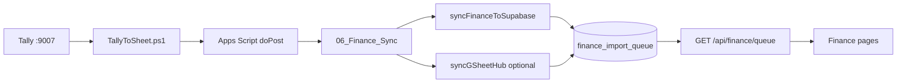

# FBOS Data Flow Map

**Date:** 2026-06-20  
**Sprint:** Core Stabilization — Phase 4  
**Branch:** `cursor/core-stabilization-0d65`  
**Scope:** Architecture documentation only — no code changes

---

## System overview



**Core principle (from `docs/ARCHITECTURE.md`):** Google Sheet `01_Dashboard` = KPI brain (formulas). Next.js app = read-only display of Supabase data for most modules. Finance has a **direct** Apps Script → Supabase path bypassing FBOS sync.

---

## Active Google Sheet tabs

| Tab | GID (owner env) | Role |
|---|---|---|
| `01_Dashboard` | 0 | KPI formulas — finance, sales, ops |
| `00_Sync_Status` | 1894959634 | Sync audit log |
| `06_Finance_Sync` | 1663252170 | All Tally finance rows (`data_type` column) |
| `07_Lead_CRM` | 339902754 | ClickUp leads mirror |
| `02_Order_Master` | 443214491 | Orders + artwork + cylinder unified |
| `CONFIG` | 639805728 | Targets + optional API keys |

---

## Module: Leads

| Aspect | Detail |
|---|---|
| **Source** | ClickUp list (primary); manual sheet rows; FBOS POST create |
| **Transformation** | Apps Script: custom fields → 15-column CRM layout; FBOS: `normalizeRow()` + `importLeadsWithDedupe()` |
| **Destination** | Supabase `leads`; mirror in `07_Lead_CRM` sheet |
| **Key fields** | `company_name`, `mobile`, `status`, `source`, `clickup_task_id` |
| **Sync entry points** | Apps Script `syncClickUpToLeadCrm()`; FBOS `POST /api/integrations/gsheet/sync`; FBOS `POST /api/integrations/clickup/sync` |
| **API** | `GET/POST /api/leads` |
| **UI** | `/lead-master`, `/leads`, sales modules |
| **Current state** | ✅ **2524 rows** (owner verified) |



---

## Module: Followups

| Aspect | Detail |
|---|---|
| **Source** | Supabase `followups` table; optional sheet tab if `GOOGLE_SHEET_GID_FOLLOWUPS` set |
| **Transformation** | Legacy schema adapt: `followup_date` ↔ `next_followup` in `lib/followups/normalize.ts`; filter/sort in app layer |
| **Destination** | Supabase `followups`; API normalizes responses |
| **Key fields** | `company_name`, `next_followup`, `status`, `notes` |
| **Sync entry points** | `importFollowupsRows()` in gsheet-hub (if GID configured); manual API CRUD |
| **API** | `GET/POST /api/followups`, `GET /api/followups/today`, `PATCH /api/followups/[id]` |
| **UI** | `/followups`, `/followups/today` |
| **Current state** | ✅ Runtime fixed (no SQL on missing `next_followup` column) |

```mermaid
flowchart LR
  SHEET[Followups sheet optional] --> HUB[syncGSheetHub] --> FU[(followups)]
  API[FBOS API CRUD] --> FU
  FU --> NORM[normalize.ts] --> UI[/followups pages]
```

---

## Module: Jobs

| Aspect | Detail |
|---|---|
| **Source** | Google Sheet `02_Order_Master` (GID 443214491) |
| **Transformation** | CSV parse → `normalizeSheetKey("Order ID")` → `order_id` → `extractJobNo()` → upsert by `job_no`; optional client match by name |
| **Destination** | Supabase `jobs` |
| **Key fields** | `job_no`, `client_id`, `status` |
| **Sync entry points** | `syncGSheetHub()` → `importOperationsRows()`; `npm run p0:sync:direct` |
| **API** | `GET /api/jobs` (batch client name fetch, no PostgREST embed) |
| **UI** | `/job-master` |
| **Current state** | ⚠️ **0 rows pre-sync** — import path fixed, owner sync required |

```mermaid
flowchart LR
  ORD[02_Order_Master] --> CSV[CSV export] --> HUB[importOperationsRows]
  HUB --> JOBS[(jobs)]
  JOBS --> API[GET /api/jobs] --> UI[/job-master]
```

**Order Master columns available for future enrichment:** Product Category, Cylinder Status, Production Status, Dispatch Date, etc. (see `ORDER_UNIFIED_HEADERS` in `Code.gs`).

---

## Module: Finance

| Aspect | Detail |
|---|---|
| **Source** | Tally Cloud → `TallyToSheet.ps1` → Apps Script `doPost` → `06_Finance_Sync` |
| **Transformation** | Apps Script `syncFinanceToSupabase()` — direct REST to Supabase; FBOS `importFinanceRows()` as secondary CSV path |
| **Destination** | Supabase `finance_import_queue` |
| **Key fields** | `data_type`, `description`, `amount`, `voucher_date`, `party_name`, `source=tally` |
| **Sync entry points** | Apps Script every 2h; FBOS gsheet-hub (re-imports CSV, clears tally-sourced rows first) |
| **API** | `GET /api/finance/queue` |
| **UI** | `/finance`, `/receivables`, `/payables`, `/pnl-dashboard` |
| **Current state** | ✅ **985 rows** (owner verified) |



---

## Module: Clients

| Aspect | Detail |
|---|---|
| **Source** | Optional sheet tab (`GOOGLE_SHEET_GID_CLIENTS` — not set in owner env); lead dedupe may create clients |
| **Transformation** | `importClientsRows()` — match by `client_code` or `company_name` |
| **Destination** | Supabase `clients` |
| **Key fields** | `company_name`, `client_code`, `gst_no`, `credit_limit` |
| **Sync entry points** | gsheet-hub clients tab; lead import side effects |
| **API** | Used indirectly via jobs/leads joins |
| **UI** | Client references in job master, lead master |
| **Current state** | ⚠️ Partial — no dedicated clients GID configured |

---

## Module: Tasks (ClickUp cache)

| Aspect | Detail |
|---|---|
| **Source** | ClickUp API (FBOS direct sync); backfill from `leads.clickup_task_id` |
| **Transformation** | `storeClickUpTasks()` upsert; `backfillClickUpTasksFromLeads()` for Apps Script path |
| **Destination** | Supabase `clickup_tasks` (primary); fallback `tasks` table |
| **Key fields** | `external_id`, `name`, `status`, `list_name`, `synced_at` |
| **Sync entry points** | `syncClickUp()`; always calls backfill after sync |
| **API** | Surfaced in `GET /api/dashboard/kpi` (`clickupTasks`); `GET /api/integrations/health` |
| **UI** | `/integrations`, dashboard KPI card |
| **Current state** | ⚠️ **0 rows pre-sync** — backfill fix deployed |

```mermaid
flowchart LR
  CU[ClickUp API] --> SYNC[syncClickUp] --> CT[(clickup_tasks)]
  LEADS[(leads.clickup_task_id)] --> BF[backfillClickUpTasksFromLeads] --> CT
  CT --> KPI[/api/dashboard/kpi]
```

---

## FBOS API layer map

| Route | Module | Supabase tables |
|---|---|---|
| `GET /api/leads` | Leads | `leads` |
| `GET /api/followups` | Followups | `followups` |
| `GET /api/followups/today` | Followups | `followups` |
| `GET /api/jobs` | Jobs | `jobs`, `clients` |
| `GET /api/finance/queue` | Finance | `finance_import_queue` |
| `GET /api/quotations` | Quotations (stub) | `quotations` |
| `GET /api/dashboard/kpi` | Dashboard | all core tables |
| `GET /api/integrations/health` | Integrations | `integrations`, sync metadata |
| `POST /api/integrations/gsheet/sync` | Sync | leads, jobs, finance, clients, followups |
| `POST /api/integrations/clickup/sync` | Sync | leads, clickup_tasks |
| `GET /api/admin/users` | Admin | `profiles` |

---

## Sync orchestration

| Command | Behavior |
|---|---|
| `npm run trace:data` | Read-only: GID resolution, sheet row counts, Supabase counts |
| `npm run p0:sync` | POST sync via local dev server (auto-detect port 3000–3002) |
| `npm run p0:sync:direct` | In-process: `syncGSheetHub()` + `syncClickUp()` via tsx |
| `npm run p0:counts` | Supabase table counts only |

Apps Script scheduled: `syncAllHub` every 2 hours (leads + finance to Supabase).

---

## Environment dependencies

| Variable | Modules affected |
|---|---|
| `GOOGLE_SHEET_ID` | All sheet CSV fetches |
| `GOOGLE_SHEET_GID_ORDERS=443214491` | Jobs / Order Master |
| `GOOGLE_SHEET_GID_LEADS=339902754` | Leads |
| `GOOGLE_SHEET_GID_FINANCE=1663252170` | Finance CSV re-import |
| `GOOGLE_WEBAPP_URL` | Leads webapp pull (preferred over CSV) |
| `CLICKUP_API_TOKEN`, `CLICKUP_LIST_ID` | Live ClickUp sync |
| `NEXT_PUBLIC_SUPABASE_URL`, `SUPABASE_SERVICE_ROLE_KEY` | All DB operations |

---

## Data population summary

| Module | Source → Destination | Rows (owner baseline) | Status |
|---|---|---|---|
| Leads | ClickUp/Sheet → `leads` | 2524 | ✅ Working |
| Followups | DB / optional sheet → `followups` | varies | ✅ API fixed |
| Jobs | Order Master → `jobs` | 0 | ⚠️ Sync pending |
| Finance | Tally → `finance_import_queue` | 985 | ✅ Working |
| Clients | Sheet optional → `clients` | partial | ⚠️ No GID |
| Tasks | ClickUp → `clickup_tasks` | 0 | ⚠️ Backfill pending |

---

## STOP boundary

This document is architecture-only. No Quotation OS, auth, middleware, or deployment changes made in this sprint.
