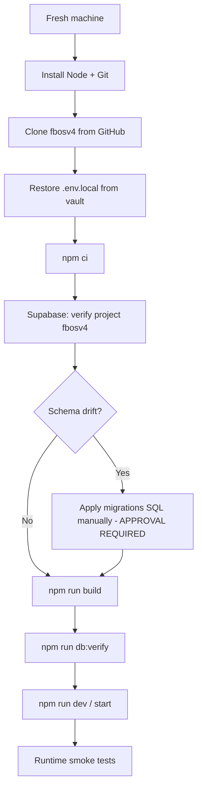

# FBOS V4 — Installer & Recovery Plan (Phase 3)

**Governance audit date:** 2026-06-20  
**Mode:** Design only — no installation or restoration performed.

---

## Goal

Any developer with backups from Phase 2 should be able to rebuild FBOS V4 on a fresh machine from zero to a verified running state.

---

## Prerequisites (fresh machine)

| Requirement | Version | Verification |
|---|---|---|
| OS | Linux, macOS, or Windows (WSL2) | — |
| Git | 2.x+ | `git --version` |
| Node.js | 22.x LTS (matches audit: v22.14.0) | `node -v` |
| npm | 10.x+ | `npm -v` |
| Supabase access | Account in org `RPOS` | Dashboard login |
| GitHub access | `RPOSFIN/fbosv4` read | `gh repo clone` or HTTPS |

Optional:

- `pg_dump` / PostgreSQL client (schema export/verify)
- PowerShell (Tally bridge scripts on Windows)

---

## Recovery Flow (high level)



---

## Step 1 — Fresh machine setup

```bash
# Linux example (nvm)
curl -o- https://raw.githubusercontent.com/nvm-sh/nvm/v0.40.1/install.sh | bash
nvm install 22
nvm use 22
```

Record Node version in recovery log.

---

## Step 2 — Git restoration

```bash
git clone https://github.com/RPOSFIN/fbosv4.git
cd fbosv4
git checkout main
git pull origin main
# Optional: checkout known-good tag
# git checkout checkpoint-YYYYMMDD
```

**Verify:**

- `git log -1` matches expected checkpoint commit
- `git status` clean

---

## Step 3 — Dependencies

```bash
npm ci
# Fallback if lock file issues:
# npm install
```

**Verify:**

- `node_modules/` present
- `npm ls next` shows `16.2.9`

---

## Step 4 — Environment restoration

1. Copy `.env.local` from secure vault (password manager / encrypted backup)
2. Place at project root: `fbosv4/.env.local`
3. Confirm critical values:

```bash
# Manual checklist — do not echo secrets to terminal logs
# NEXT_PUBLIC_SUPABASE_URL → fbosv4 project
# NEXT_PUBLIC_SUPABASE_ANON_KEY → set
# SUPABASE_SERVICE_ROLE_KEY → set
# NEXT_PUBLIC_AUTH_DISABLED → false or unset
# FBOS_AUTH_DISABLED → false or unset
# SHEET_SYNC_SECRET → set
# CLICKUP_API_TOKEN → set (if using ClickUp)
```

**Create `.env.example`** (future approved task) before relying on any developer without vault access.

---

## Step 5 — Supabase restoration

### 5a. Verify project connection

| Field | Expected |
|---|---|
| Project name | `fbosv4` |
| Project ID | `tksfskkivoahggneptqk` |
| Region | `ap-southeast-2` |
| Status | `ACTIVE_HEALTHY` |

### 5b. Schema state

**If using existing cloud project (normal recovery):**

- No migration needed if project intact
- Run verification only (Step 7)

**If rebuilding database from scratch (disaster):**

1. Create new Supabase project (requires org approval + cost confirmation)
2. Apply SQL in order:
   - `supabase/migrations/001_phase2_complete.sql`
   - `002_profiles_auth_patch.sql`
   - `003_integrations.sql`
   - `004_integration_tables.sql`
   - `005_leads_clickup_dedupe.sql` ⚠️ **currently empty — must be fixed before use**
   - `006_lead_history.sql`
   - `RUN_PENDING_INTEGRATIONS.sql` (if needed)
   - `RUN_FINANCE_SETUP.sql` or `RUN_FINANCE_SETUP_MIN.sql`
3. Update `.env.local` with new project URL and keys
4. Re-seed `integrations` connector rows if missing

### 5c. Data restoration

- **Table data:** Use Supabase point-in-time recovery (if enabled on plan) or `pg_dump` / `pg_restore` from backup
- **Auth users:** Restored with `auth` schema dump or users re-invited
- **Storage:** No buckets currently — N/A

---

## Step 6 — Build verification

```bash
npm run lint          # Expect warnings in scripts/ — document baseline
npx tsc --noEmit      # Currently FAILS — must be fixed before production recovery
npm run build         # Gate: must pass before calling recovery complete
```

**Current known blockers (as of audit):**

- `lib/auth/config.ts` — `MOCK_USER.name` type error
- `lib/integrations/gsheet-hub.ts` — missing gid keys
- `lib/integrations/gsheet.ts` — `getGoogleWebappUrl` arity

Recovery is **not complete** until `npm run build` passes on target commit.

---

## Step 7 — Database verification

```bash
npm run db:verify
```

Script: `scripts/verify-database.mjs` — checks required tables exist.

**Manual Supabase checks:**

- 22 public tables present
- RLS enabled on all tables
- `integrations` has 3 connector rows (gsheet, clickup, tally)
- Auth → Users (if auth enabled)

---

## Step 8 — Runtime verification

```bash
npm run dev
# Production: npm run build && npm start
```

### Smoke test checklist

| URL / endpoint | Expected |
|---|---|
| `http://localhost:3000/login` | Login form (not bypass redirect) — **currently fails: auth disabled** |
| `http://localhost:3000/dashboard` | Dashboard loads |
| `http://localhost:3000/integrations` | Integration hub loads |
| `GET /api/health/database` | 200 with table status (requires auth when enabled) |
| `GET /api/webhooks/sheet-sync` | 200 info JSON (no secret required for GET) |
| `POST /api/integrations/gsheet/sync` | Requires auth + integration permission |

### Integration verification (post-auth fix)

| Integration | Test |
|---|---|
| Google Sheets | POST gsheet sync or webhook with `SHEET_SYNC_SECRET` |
| ClickUp | POST clickup sync with valid token |
| Tally | Run `scripts/test-tally-gateway.mjs` against Tally host |
| WhatsApp | N/A — not implemented |

---

## Step 9 — Google Apps Script & Tally (optional components)

### Google Apps Script

1. Restore Apps Script project from Google Drive / script ID backup
2. Set script properties: `SUPABASE_URL`, `SUPABASE_SERVICE_KEY`, `SYNC_SECRET`, `FBOS_WEBHOOK_URL`
3. Deploy web app URL → update `GOOGLE_WEBAPP_URL` env or `lib/google-config.ts` (prefer env)
4. Use `scripts/google-apps-script/` tooling only if redeploying code via CDP

### Tally bridge

1. Install on Windows machine with Tally access
2. Run `scripts/tally-cloud/Install-TallySync.ps1`
3. Configure `TALLY_HOST`, company name in `.env.local`

---

## Recovery time objectives (design targets)

| Scenario | Target | Current realistic |
|---|---|---|
| Code-only restore (Git + npm) | < 30 min | ✅ Achievable |
| Full env + build | < 2 hours | ⚠️ Blocked by build errors |
| DB rebuild from SQL | < 4 hours | ⚠️ Blocked by empty `005`, migration drift |
| Complete laptop-loss recovery | < 1 day | ❌ Requires vault + build fixes + runbooks |

---

## Deliverables to create (future approved phase)

1. `INSTALL.md` — human-readable recovery guide
2. `.env.example` — full variable list
3. `recover.sh` / `recover.ps1` — automated steps 2–7
4. `verify-recovery.mjs` — build + db + HTTP smoke tests
5. Fix empty `005_leads_clickup_dedupe.sql`
6. Fix TypeScript build errors

---

## Phase 3 Verdict

Recovery path is **documented and mostly feasible** for source code, but **not yet executable end-to-end** due to build failures, missing env template, empty migration file, and auth bypass state.

**Recovery readiness score:** **38 / 100**

**Status:** ✅ Phase 3 complete — design only. Awaiting approval.
