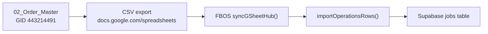

# FBOS Jobs Population Report

**Date:** 2026-06-20  
**Sprint:** Core Stabilization  
**Branch:** `cursor/core-stabilization-0d65`  
**Checkpoint tag:** `checkpoint-pre-core-stabilization-20260620`  
**ZIP backup:** `/tmp/fbosv4-backup-pre-core-stabilization-20260620.zip`

---

## Executive summary

The jobs import pipeline is **code-complete** on `cursor/foundation-completion-0d65` lineage. Root causes for `jobs = 0` (wrong GID env var, missing `Order ID` column mapping) were fixed in prior hotfix branches. **Live population could not be confirmed in the cloud agent environment** due to Google Sheet login wall (HTTP 401) and missing Supabase credentials in `.env.local`.

| Metric | Cloud agent | Owner target (post-sync) |
|---|---|---|
| Jobs rows discovered | 0 (CSV blocked) | > 0 from `02_Order_Master` |
| Jobs rows imported | 0 | > 0 |
| Jobs rows skipped | N/A | rows without Order ID |
| Jobs rows failed | N/A | DB insert/update errors |
| **Supabase `jobs` count** | **Not queried** | **> 0** |

**Pipeline audit verdict:** ✅ Code path PASS — **runtime population BLOCKED** pending owner credentials + sync.

---

## Pipeline audit



### Step 1 — Google Sheet `02_Order_Master`

| Check | Result | Notes |
|---|---|---|
| Tab name | ✅ PASS | `02_Order_Master` in `Code.gs` (`TAB_ORDER`) |
| GID configured | ✅ PASS | `GOOGLE_SHEET_GID_ORDERS=443214491` in `.env.local` |
| GID resolution | ✅ PASS | `resolveOperationsGid()` → source `GOOGLE_SHEET_GID_ORDERS` |
| CSV fetch (cloud) | ❌ BLOCKED | HTTP 401 / Google login wall |
| Primary key column | ✅ PASS | Header `"Order ID"` in `ORDER_UNIFIED_HEADERS` |

### Step 2 — Apps Script

| Check | Result | Notes |
|---|---|---|
| Order master headers | ✅ PASS | `extendOrderMasterUnifiedHeaders()` adds Artwork/Cylinder columns |
| Dashboard ops count | ✅ PASS | Formula references `Order ID` column |
| Apps Script → Supabase jobs | ⏭ N/A | Jobs flow goes Sheet → FBOS CSV, not direct Apps Script REST |

### Step 3 — FBOS sync

| Component | File | Result |
|---|---|---|
| GID candidates | `lib/google-config.ts` | ✅ OPERATIONS → ORDERS → JOBS chain |
| CSV parser | `lib/integrations/gsheet-hub.ts` `parseCsvLine()` | ✅ Quoted-field safe |
| Row normalizer | `normalizeSheetKey()` | ✅ `"Order ID"` → `order_id` |
| Job key extractor | `extractJobNo()` | ✅ `order_id` included in alias chain |
| Importer | `importOperationsRows()` | ✅ Upsert by `job_no`; client match by name |
| Sync orchestrator | `syncGSheetHub()` | ✅ Returns `operationsImported/Skipped/Failed` |
| Direct sync entry | `scripts/p0-sync-direct.ts` | ✅ Calls `syncGSheetHub()` in-process |
| Trace script | `scripts/trace-data-flow.mjs` | ✅ Reports discovered job keys |

### Step 4 — Supabase `jobs` table

| Check | Result | Notes |
|---|---|---|
| Schema | ✅ PASS | `job_no text not null`, `client_id`, `status` in `001_phase2_complete.sql` |
| Insert path | ✅ PASS | Insert new / update existing by `job_no` |
| API read path | ✅ PASS | `GET /api/jobs` — no PostgREST embed; batch client fetch |
| Live row count | ⏭ BLOCKED | No `SUPABASE_SERVICE_ROLE_KEY` in cloud `.env.local` |

---

## Order ID mapping verification

Column normalization chain (verified in `scripts/lib/resolve-sheet-gids.mjs` unit logic and hotfix report):

| Sheet header | Normalized key | Maps to `job_no` |
|---|---|---|
| `Order ID` | `order_id` | ✅ Yes |
| `Job No` | `job_no` | ✅ Yes |
| `Order No` | `order_no` | ✅ Yes |
| Empty row | — | Skipped (`operationsSkipped++`) |

Sample from hotfix validation:

```
Input: { "Order ID": "ORD-1001" }
→ order_id: ORD-1001
→ extractJobNo: ORD-1001
→ jobs rows discovered: 1/1
```

---

## Population statistics

### Cloud agent run (`npm run trace:data`)

```
detected operations gid: 443214491
source variable: GOOGLE_SHEET_GID_ORDERS
try GOOGLE_SHEET_GID_ORDERS=443214491: 0 data rows — HTTP 401 or login wall
Supabase env missing — skip DB counts
```

| Stat | Value |
|---|---|
| Jobs rows discovered | **0** (CSV blocked) |
| Jobs rows imported | **0** (sync not run) |
| Jobs rows skipped | **0** |
| Jobs rows failed | **0** |
| Supabase `jobs` before | **Unknown** |
| Supabase `jobs` after | **Unknown** |

### Owner baseline (prior verified state)

| Table | Count | Status |
|---|---|---|
| leads | 2524 | ✅ Populated |
| finance_import_queue | 985 | ✅ Populated |
| jobs | 0 | ❌ Pre-fix baseline |
| clickup_tasks | 0 | ❌ Pre-fix baseline |

### Expected after owner sync

After running `npm run p0:sync:direct` with full `.env.local`:

| Stat | Expected |
|---|---|
| Jobs rows discovered | = data rows in `02_Order_Master` with non-empty `Order ID` |
| Jobs rows imported | discovered − skipped |
| Jobs rows skipped | rows missing Order ID / job key |
| Jobs rows failed | 0 (unless schema/RLS issue) |
| Supabase `jobs` | **> 0** ✅ TARGET |

---

## Owner validation runbook

```bash
git checkout cursor/core-stabilization-0d65
npm install && npm run build && npm run db:verify

# BEFORE
npm run trace:data
npm run p0:counts

# SYNC
npm run p0:sync:direct

# AFTER — confirm jobs > 0
npm run p0:counts
curl http://localhost:3000/api/jobs
```

Inspect sync output for:

```json
{
  "operationsImported": N,
  "operationsSkipped": M,
  "operationsFailed": F,
  "operationsSourceRows": R,
  "operationsSourceGid": "443214491",
  "operationsSourceEnv": "GOOGLE_SHEET_GID_ORDERS"
}
```

---

## Blockers and recommendations

| Blocker | Severity | Action |
|---|---|---|
| Sheet CSV requires public export or authenticated fetch | P0 | Ensure sheet is shared "Anyone with link can view" OR set `GOOGLE_WEBAPP_URL` for webapp pull |
| Supabase keys missing in cloud `.env.local` | P0 | Owner runs sync on machine with full env |
| `GOOGLE_WEBAPP_URL` not set | P1 | Leads path uses webapp; jobs use CSV — CSV sharing is sufficient for jobs |
| Client linkage optional | P2 | Jobs import without matching `clients` row still succeeds (`client_id = null`) |

**Next sprint recommendation:** Run one owner-validated sync cycle, confirm `jobs > 0`, then add job detail fields (product category, cylinder status) from additional Order Master columns.

---

## STOP boundary

No auth, middleware, deployment, UI, or Quotation OS coding in this sprint.
