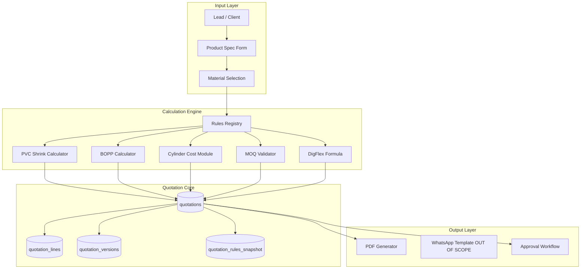
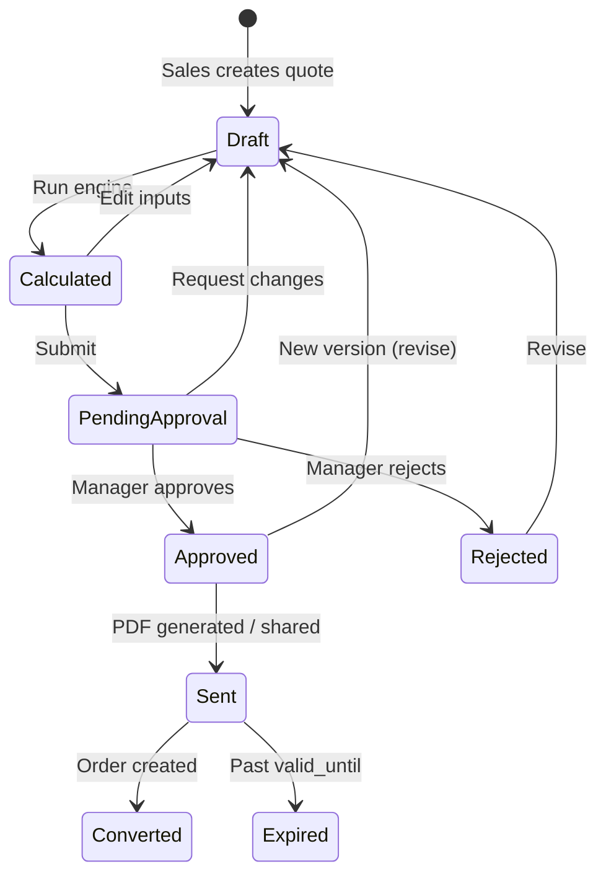

# Quotation OS — Architecture Readiness Document

**Date:** 2026-06-20  
**Sprint:** Core Stabilization — Phase 5  
**Branch:** `cursor/core-stabilization-0d65`  
**Status:** ARCHITECTURE ONLY — **NO CODING**

---

## Purpose

Prepare the design foundation for **Quotation OS** — a structured quoting engine for Flexiflair's flexible packaging products — before any implementation sprint. Foundation and data population must reach 90%+ before development begins.

---

## Current state audit

### Existing codebase (minimal)

| Asset | Location | Maturity |
|---|---|---|
| `quotations` table | `supabase/migrations/001_phase2_complete.sql` | Schema stub only |
| `GET/POST /api/quotations` | `app/api/quotations/route.ts` | CRUD stub — no calculation |
| `/quotations` page | `app/quotations/page.tsx` | Manual entry form + list |
| `QuotationTable` component | `components/quotation-table.tsx` | Placeholder div |
| RBAC | `lib/rbac/permissions.ts` | `quotations: read/create` for sales roles |
| Dashboard KPI | `app/api/dashboard/kpi/route.ts` | Count only |
| Sales pipeline stages | `app/sales-pipeline/page.tsx` | Includes "Quotation Sent" |
| CEO dashboard copy | `app/ceo-command-center/page.tsx` | Static "8 Quotations Awaiting Approval" |

### Business rules audit (repo search)

| Rule domain | Found in codebase? | Evidence |
|---|---|---|
| **PVC Shrink Rules** | ❌ Not codified | Product category label in dashboard CSV (`scripts/_dash_live.csv`: "PVC Shrink") |
| **BOPP Rules** | ❌ Not codified | Dashboard CSV label "BOPP Label" |
| **Cylinder Rules** | ⚠️ Data columns only | `ORDER_UNIFIED_HEADERS`: Cylinder Status, Cylinder ID, Cylinder Cost, No Of Colors, Reusable |
| **MOQ Rules** | ❌ Not found | No MOQ logic in repo |
| **DigFlex Formula** | ❌ Not found | No pricing formula engine |
| **Material Rules** | ❌ Not found | Product Category column exists on Order Master only |
| **Customer Rules** | ⚠️ Partial | `clients.credit_limit`, GST fields; no quote-specific customer tier rules |

**Conclusion:** Business rules live in **operations knowledge / spreadsheets / team practice**, not in FBOS code. Quotation OS must introduce a formal **rules engine layer** sourced from stakeholder workshops and existing Excel/Sheet calculators.

### Inferred product categories (from live dashboard data)

- PVC Shrink
- BOPP Label
- (Additional categories expected: DigFlex, laminates, pouches — to be confirmed with sales/ops)

---

## Target architecture



---

## Database tables (proposed)

### Existing (extend)

**`quotations`** — header record

| Column | Type | Notes |
|---|---|---|
| `id` | uuid PK | Existing |
| `quotation_no` | text | Auto-sequence `Q-YYYY-NNNN` |
| `client_id` | uuid FK | Existing |
| `lead_id` | uuid FK | Existing |
| `status` | text | Draft → Sent → Approved → Rejected → Expired → Converted |
| `product_category` | text | PVC Shrink / BOPP / DigFlex / … |
| `version` | int | Current version number |
| `parent_quotation_id` | uuid | For revisions |
| `subtotal` | numeric | Pre-tax |
| `tax_amount` | numeric | GST |
| `total_amount` | numeric | Final |
| `valid_until` | date | Quote expiry |
| `approved_by` | uuid FK | profiles |
| `approved_at` | timestamptz | |
| `calculation_snapshot` | jsonb | Frozen rule inputs/outputs |
| `pdf_url` | text | Storage path |
| `created_by`, `updated_by` | uuid | Existing |

### New tables

**`quotation_lines`** — line items

| Column | Type | Notes |
|---|---|---|
| `id` | uuid PK | |
| `quotation_id` | uuid FK | |
| `line_no` | int | |
| `sku_description` | text | |
| `material_type` | text | |
| `width_mm`, `length_mm`, `gauge_mic` | numeric | Dimensions |
| `quantity` | numeric | Order qty |
| `moq` | numeric | Minimum order qty |
| `unit_rate` | numeric | |
| `line_total` | numeric | |
| `cylinder_cost_allocated` | numeric | Amortized per MOQ rules |

**`quotation_versions`** — version control

| Column | Type | Notes |
|---|---|---|
| `id` | uuid PK | |
| `quotation_id` | uuid FK | |
| `version` | int | |
| `snapshot` | jsonb | Full quote state at version time |
| `changed_by` | uuid | |
| `change_reason` | text | |
| `created_at` | timestamptz | |

**`quotation_rules`** — configurable rule definitions

| Column | Type | Notes |
|---|---|---|
| `id` | uuid PK | |
| `rule_code` | text unique | e.g. `PVC_SHRINK_MOQ_2026` |
| `category` | text | PVC / BOPP / CYLINDER / MOQ / CUSTOMER |
| `name` | text | Human label |
| `definition` | jsonb | Rule parameters (rates, thresholds, formulas) |
| `effective_from` | date | |
| `effective_to` | date | nullable |
| `is_active` | boolean | |

**`quotation_approvals`** — approval flow audit

| Column | Type | Notes |
|---|---|---|
| `id` | uuid PK | |
| `quotation_id` | uuid FK | |
| `version` | int | |
| `approver_id` | uuid FK | |
| `action` | text | approve / reject / request_changes |
| `comments` | text | |
| `created_at` | timestamptz | |

**`products`** — extend existing stub

Link material master to rule categories (`category`, `base_rate`, `unit`).

---

## API endpoints (proposed)

| Method | Route | Purpose |
|---|---|---|
| GET | `/api/quotations` | List with filters (status, client, date) |
| POST | `/api/quotations` | Create draft |
| GET | `/api/quotations/[id]` | Full quote with lines + version |
| PATCH | `/api/quotations/[id]` | Update draft fields |
| POST | `/api/quotations/[id]/calculate` | Run calculation engine |
| POST | `/api/quotations/[id]/lines` | Add/update line items |
| POST | `/api/quotations/[id]/submit` | Submit for approval |
| POST | `/api/quotations/[id]/approve` | Manager approval |
| POST | `/api/quotations/[id]/reject` | Rejection with reason |
| POST | `/api/quotations/[id]/revise` | Create new version |
| GET | `/api/quotations/[id]/pdf` | Generate/download PDF |
| GET | `/api/quotation-rules` | List active rules (admin) |
| POST | `/api/quotation-rules` | Create/update rules (admin) |
| GET | `/api/quotation-rules/[code]/evaluate` | Test rule against inputs |

**Not in scope (this sprint):** WhatsApp send endpoint, Twilio integration.

---

## Workflow



### Role gates (align with existing RBAC)

| Action | Roles |
|---|---|
| Create / edit draft | sales, sales_manager, admin |
| Submit for approval | sales, sales_manager |
| Approve / reject | sales_manager, admin, super_admin |
| Manage rules | admin, super_admin |
| View all quotes | sales_manager, admin, ceo |

---

## Calculation engine (design)

### Engine structure

```
lib/quotation/
  engine/
    index.ts           — orchestrator
    types.ts           — QuoteInput, QuoteResult, RuleContext
    registry.ts        — rule loader from quotation_rules table
    calculators/
      pvc-shrink.ts
      bopp-label.ts
      digflex.ts
      cylinder.ts
      moq.ts
    validators/
      customer-credit.ts
      material-compat.ts
  pdf/
    template.tsx       — React-PDF or puppeteer HTML
  version/
    snapshot.ts        — immutable version snapshots
```

### Rule evaluation order

1. **Customer rules** — credit limit, special pricing tier, GST type
2. **Material rules** — valid material + category combination
3. **Product calculator** — PVC / BOPP / DigFlex formula
4. **Cylinder rules** — new vs reusable cylinder; color count; amortization over MOQ
5. **MOQ rules** — enforce minimum quantity; adjust unit rate for below-MOQ
6. **Tax** — GST slab from client + product category
7. **Snapshot** — persist inputs + outputs to `calculation_snapshot`

### Placeholder formulas (to be validated with ops team)

| Category | Inputs | Output (conceptual) |
|---|---|---|
| PVC Shrink | width, length, gauge, qty, colors | `(film_cost + print_cost + cylinder_amort) × qty` |
| BOPP Label | roll width, repeat length, qty, finishes | `(material_m2 × rate + finishing) × qty` |
| DigFlex | layers, structure, qty | Multi-layer laminate formula (TBD) |
| Cylinder | colors, width, new/reusable | `cylinder_cost / max(MOQ, qty)` |
| MOQ | category, qty | Block or surcharge if `qty < moq_threshold` |

**Critical:** All numeric constants must be loaded from `quotation_rules.definition` JSON — never hardcoded in application code.

---

## Approval flow

| Step | Actor | System action |
|---|---|---|
| 1 | Sales | Creates draft, enters specs |
| 2 | System | Runs calculation engine |
| 3 | Sales | Reviews totals, submits |
| 4 | Sales Manager | Receives notification (future notification engine — out of scope) |
| 5 | Manager | Approve / reject / request changes |
| 6 | System | Locks version; writes `quotation_approvals` row |
| 7 | Sales | Generates PDF, marks Sent |

**Discount override:** Any manual discount > X% requires admin approval (rule configurable).

---

## Version control

- Every **Submit** creates an immutable snapshot in `quotation_versions`
- **Revise** after approval increments `version`, links `parent_quotation_id`
- PDF output always references `quotation_no` + `version` (e.g. `Q-2026-0042-v3`)
- `calculation_snapshot` stores rule codes + versions used at calculation time for audit

---

## PDF output (design)

| Requirement | Approach |
|---|---|
| Template | HTML + puppeteer OR `@react-pdf/renderer` |
| Content | Company header, client details, line table, terms, validity, approver signature block |
| Storage | Supabase Storage bucket `quotations/` |
| URL | `quotations.pdf_url` |
| Trigger | `GET /api/quotations/[id]/pdf` or post-approval auto-generate |

---

## WhatsApp output (deferred)

Per sprint STOP rules: **WhatsApp and Twilio are explicitly out of scope.**

Future design hook: after PDF generation, queue message to notification engine with template ID and PDF link. No implementation in this phase.

---

## Integration points with existing FBOS

| Module | Integration |
|---|---|
| Leads | `quotations.lead_id` — convert lead → quote |
| Clients | `quotations.client_id` — credit limit check |
| Jobs / Orders | Approved quote → create order in `02_Order_Master` / `jobs` |
| Dashboard | KPI: pending approvals, conversion rate |
| ClickUp | Optional: update task status to QUOATED on quote sent |
| Google Sheet | Optional: export approved quotes to new tab (not KPI brain) |

---

## Prerequisites before coding sprint

| # | Prerequisite | Owner |
|---|---|---|
| 1 | Document PVC / BOPP / DigFlex formulas from ops Excel | Sales + Production |
| 2 | MOQ thresholds per category | Sales manager |
| 3 | Cylinder cost table (new vs reuse) | Production |
| 4 | Customer tier / discount rules | Admin |
| 5 | Foundation sync complete (`jobs > 0`, `clickup_tasks > 0`) | Dev |
| 6 | Auth sub-phase decision (currently disabled) | Product owner |
| 7 | PDF letterhead + terms template | Admin |

---

## Recommended implementation phases (future — NOT started)

| Phase | Scope |
|---|---|
| Q1 | Rules table + admin UI + PVC calculator only |
| Q2 | BOPP + cylinder + MOQ |
| Q3 | Approval workflow + PDF |
| Q4 | DigFlex + customer tiers + order conversion |
| Q5 | WhatsApp output (separate notification sprint) |

---

## STOP confirmation

- ✅ Architecture document created
- ❌ No Quotation OS code written
- ❌ No new migrations applied
- ❌ No WhatsApp / Twilio / AI modules touched

**Do not begin Quotation OS coding until foundation data population reaches 90%+ and business rules are documented by ops team.**
