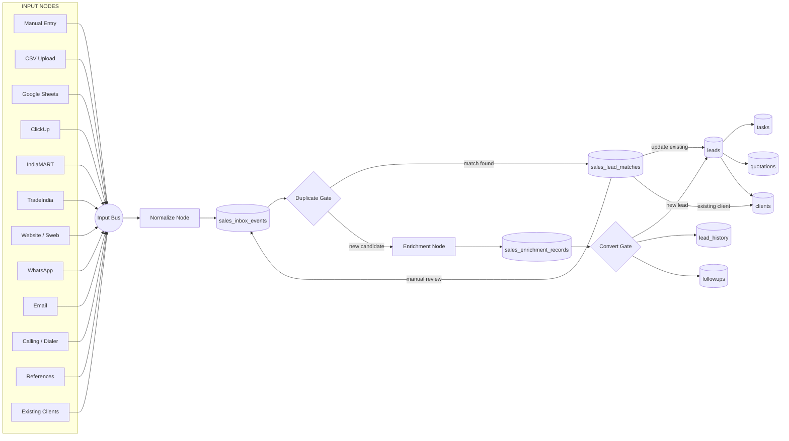
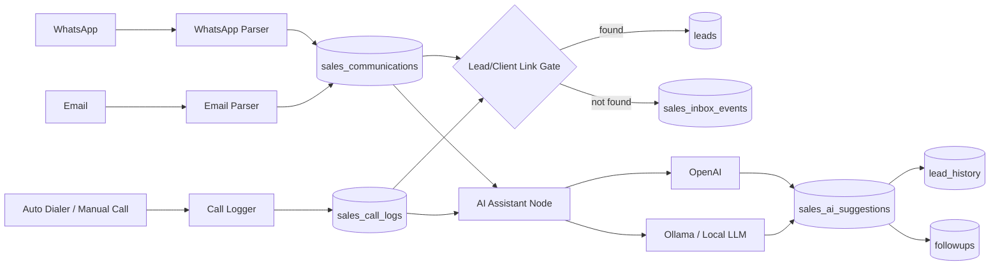
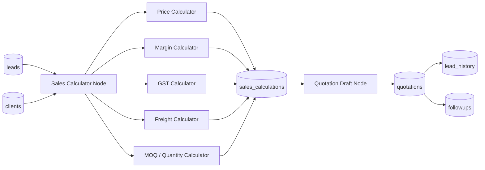
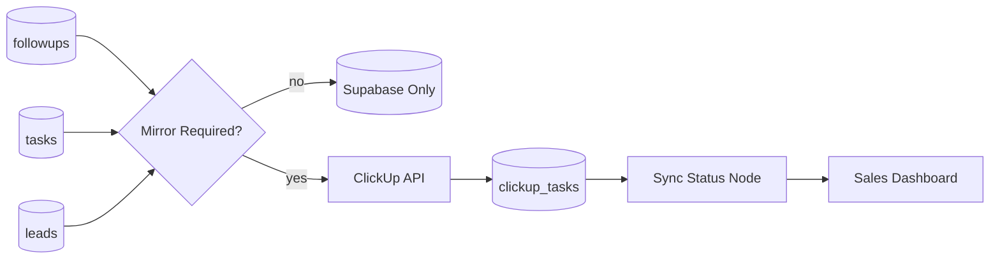
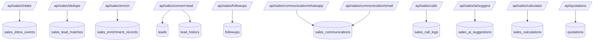

# Sales OS Backend Circuit Graph

This document explains Sales OS like an AI calling agent backend graph. Think of every box as a backend node. Data moves through edges. Supabase tables are memory nodes.

## Graph 1: Full Sales Backend Circuit

## Graph 2: Communication and Call Coach Circuit

## Graph 3: Calculator and Quotation Circuit

## Graph 4: ClickUp Mirror Circuit

## Graph 5: Backend API Map

## Node Responsibilities

### Input Bus

Receives all raw data from manual entry, CSV, Google Sheets, ClickUp, IndiaMART, TradeIndia, WhatsApp, Email, website, calling, references, and existing clients.

### Normalize Node

Standardizes names, mobile, email, source ids, product interest, message text, and raw payload.

### Duplicate Gate

Checks against leads and clients by mobile, email, company name, and external ids.

### Enrichment Node

Calls BIS, MCA, FSSAI, GST, TIN, TSIN, or other verification sources.

### Convert Gate

Decides whether to create a new lead, update existing lead, create followup, create opportunity for existing client, or ignore duplicate.

### AI Assistant Node

Routes prompts to OpenAI, Ollama, or local LLM and stores output in sales_ai_suggestions.

### Calculator Node

Creates pricing, margin, GST, freight, MOQ, and quotation helper outputs.

## Hard Rule

No external source writes directly into leads. Every source must pass through a controlled node path.
